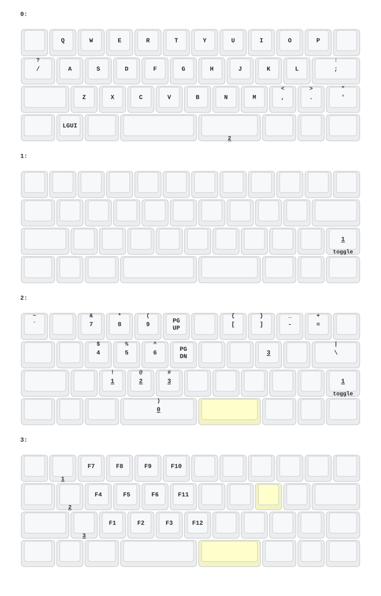

# ZMK Firmware for Eyelash40 

This repository contains ZMK firmware configurations for my personal Eyelash40, based on work by PH Design.

## Download Firmware

1. Go to the **Actions** tab
2. Click on a successful build (look for the green checkmark ✓)
3. Download the firmware file from the **Artifacts** section
4. Flash it to your keyboard

## About PH-Lite

**PH-Lite** is what we call the nRF52840-based wireless controller shield used in our keyboards. 

### Why "Lite"?

When we decided to build a wireless keyboard, we spent 3 months developing a custom wireless solution and another 6 months writing the firmware from scratch. However, due to the slow progress, we decided to migrate to ZMK firmware instead. This allowed us to focus on what matters most - creating great keyboards - while leveraging the solid foundation that ZMK provides.

## Supported Keyboards

- **PH60-SC V2** - 60% keyboard with Kailh Low Profile Switches and per-key RGB underglow
- **PH60-Multi V2** - 60% keyboard with multiple layout and split spacebar options

## Features

- ZMK Studio support enabled
- USB and Bluetooth connectivity
- Battery management
- Super low power consumption
- Some custom features not in mainstream ZMK

**Team PH Design**
